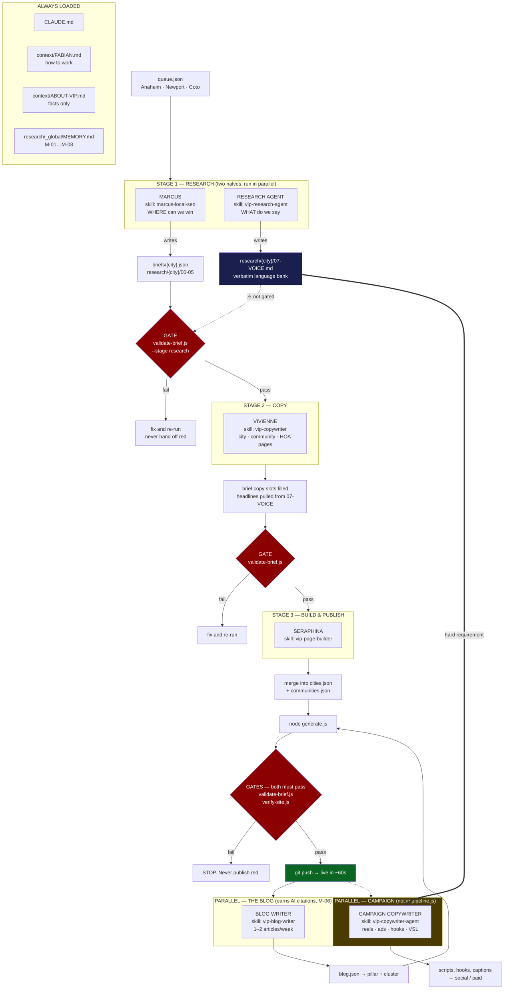

# PIPELINE MAP — research → copy → live pages

The whole system on one page. **Every box links to the file that governs it.**

Status: **for review.** Three gaps are marked ⚠️ — they are real, not oversights I hid.

---

## THE FLOW



---

## STAGE 1 — RESEARCH

Two different questions. **Both run before copy. Neither replaces the other.**

| | Marcus | Research Agent |
|---|---|---|
| Skill | [marcus-local-seo](../generator/skills/marcus-local-seo/SKILL.md) | [vip-research-agent](../generator/skills/vip-research-agent/SKILL.md) |
| Governed by | [MARCUS.md](../generator/agents/marcus/MARCUS.md) | the skill file |
| Method | [RESEARCH-BLUEPRINT.md](../generator/research/_global/RESEARCH-BLUEPRINT.md) | [HALO-WORKSHEET.md](../generator/research/_global/HALO-WORKSHEET.md) |
| Question | **Where can we win?** | **What do we say?** |
| Writes | `briefs/{city}.json`, `research/{city}/00-05` | `research/{city}/07-VOICE.md` |
| Tools | Firecrawl · Apify Maps · Apify Ahrefs — [TOOLS.md](../generator/research/_global/TOOLS.md) | autocomplete · Apify review text · Firecrawl |
| Contract | [RESEARCH-BRIEF-CONTRACT.md](../generator/RESEARCH-BRIEF-CONTRACT.md) | the worksheet's own sections |
| Command | `node generator/pipeline.js next marcus` | run the skill |

**Who we're writing for:** only ~3% of homeowners are ready to hire today. The copy targets
the **97% who are stalling** — the standing avatar is Diane, the Reluctant Repainter. Her
core fear is picking a color, living with it ten years, and hating it. She is buying
certainty; paint is the delivery mechanism.

**The trap (M-07):** Google reviews are written by the 3% who already bought. Verified on
real Anaheim data — 17 reviews of a 53-review painter, every one about the crew, not one
about color regret. Good for Barriers, useless for Pains & Fears.

---

## STAGE 2 — COPY

| | |
|---|---|
| Skill | [vip-copywriter](../generator/skills/vip-copywriter/SKILL.md) |
| Governed by | [COPYWRITER.md](../generator/agents/copywriter/COPYWRITER.md) |
| Also loads | [HEADLINE-FORMULAS.md](../generator/agents/copywriter/HEADLINE-FORMULAS.md) · [COPY-SLOTS.md](../generator/agents/copywriter/COPY-SLOTS.md) · [STORY-SLOTS.md](../generator/agents/copywriter/STORY-SLOTS.md) |
| Reads | `briefs/{city}.json` · `research/{city}/00-SUMMARY.md` · **`07-VOICE.md`** |
| Writes | the copy slots in the brief |
| Command | `node generator/pipeline.js next copywriter` |

**Headlines come from the language bank, not from imagination.** Lead from Theme 2 (Pains
& Fears) — fear outweighs aspiration.

**Kill test on every headline:** could a competitor put their logo on this unchanged? Then
rewrite it.

---

## STAGE 3 — BUILD & PUBLISH

| | |
|---|---|
| Skill | [vip-page-builder](../generator/skills/vip-page-builder/SKILL.md) |
| Governed by | [PIPELINE.md](../generator/PIPELINE.md) |
| Merges into | [cities.json](../generator/cities.json) · [communities.json](../generator/communities.json) |
| Builds | `node generator/generate.js` → 5 page types per city |
| Gates | `validate-brief.js` **and** `verify-site.js` — both green or stop |
| Command | `node generator/pipeline.js next seraphina` |

**Five page types per city:** city hub · community · HOA · pillar guide · cluster article.

### The two gates, and why there are two

| | Checks | Catches |
|---|---|---|
| [validate-brief.js](../generator/validate-brief.js) | the **input** — the brief | missing fields, unsourced HOA claims, short FAQs |
| [verify-site.js](../generator/verify-site.js) | the **rendered output** | dead + absolute links, banned copy, broken schema, FAQ mismatch, wrong warranty, silo breaches |

**Every miss that ever reached a live page was invisible to input validation** — "Free
Quote" and a fake 5-star rating came from hardcoded generator strings, and absolute links
404'd on GitHub Pages twice. That is why the second gate exists and why publishing is
blocked on it.

---

## PARALLEL TRACKS

### The blog — this is what earns AI citations

| | |
|---|---|
| Skill | [vip-blog-writer](../generator/skills/vip-blog-writer/SKILL.md) |
| Governed by | [BLOG.md](../generator/agents/blog/BLOG.md) · [BLOG-WORKFLOW.md](../generator/agents/blog/BLOG-WORKFLOW.md) |
| Plan | [BLOG-PLAN-IRVINE.md](../generator/agents/blog/BLOG-PLAN-IRVINE.md) |
| Writes | `blog.json` → pillar + cluster articles |
| Cadence | **1–2 a week.** Ten at once reads as manufactured |

**Why (M-06):** CertaPro has 313 AI citations; one blog post earns 55 while their hundreds
of landing pages earn nothing. Copilot 50% + Google AI Mode 36% = 86%. Copilot runs on
Bing — so Bing Webmaster Tools beats any ChatGPT tactic.

### Campaign copy — reels, ads, hooks

| | |
|---|---|
| Skill | [vip-copywriter-agent](../generator/skills/vip-copywriter-agent/SKILL.md) |
| Formulas | [HEADLINE-FORMULAS.md](../generator/agents/copywriter/HEADLINE-FORMULAS.md) Part F |
| Hard requirement | `07-VOICE.md`. **No language bank → it stops.** |
| Output | reel scripts, hooks, captions, VSL, DM sequences — **off-site** |

**Two copywriters, two surfaces, one rule that contradicts:** campaign copy is banned from
opening with the company name. Page copy **requires** it in answer capsules, because those
are built to survive being quoted by an AI engine with no page around them. Do not apply
one skill's rule to the other's work.

---

## ⚠️ THE THREE GAPS — decide these

**1. The voice stage is not in `pipeline.js`.**
It runs as a routine beside the pipeline. Nothing stops the copywriter starting without a
language bank — it will warn and fall back to personas, but the gate does not block it.
*Fix if you want it enforced:* add a `voiced` stage to `queue.json` and a
`--stage voice` check to `validate-brief.js`. Half a day.

**2. Campaign copy has no stage at all.**
It is on-demand only, so nothing schedules reels or tracks which hooks shipped.
*Fix if you want it systematic:* a `vip-campaign` routine on a weekly cadence, plus a
`campaigns/{city}.json` to record what ran and what it came from.

**3. The two new skills have no agent doc.**
Marcus, Vivienne and the blog each have a file in `generator/agents/`. The research agent
and campaign copywriter live only as `SKILL.md`. Fine today; it will drift when their
instructions get longer.

---

## RUN IT

```bash
node generator/pipeline.js status          # the board
node generator/pipeline.js next marcus     # what's next, for whom
node generator/generate.js                 # build all pages
node generator/validate-brief.js anaheim   # gate 1 — the input
node generator/verify-site.js anaheim      # gate 2 — the output
```

Unattended: the four prompts in [ROUTINES.md](ROUTINES.md) advance a city about a stage a
day, and nothing publishes unless both gates are green.

**Blocked on Fabian, and no routine can do it:** move the Google Business Profile from
Fontana to Anaheim. Every Maps tactic waits on it. Organic and AI search do not.
